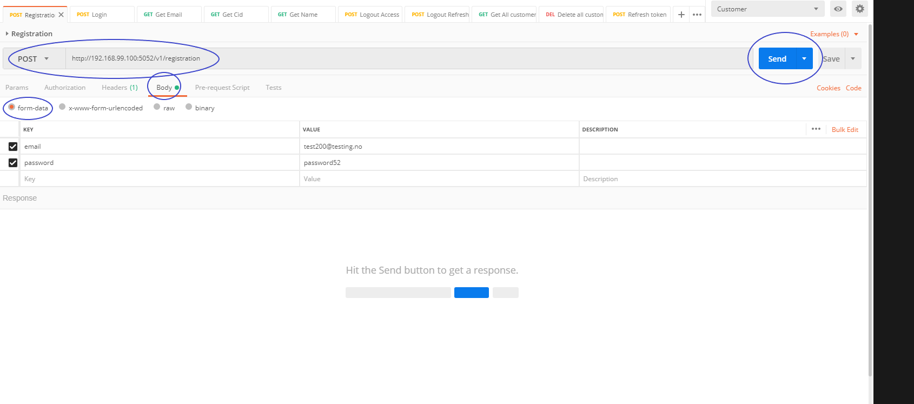
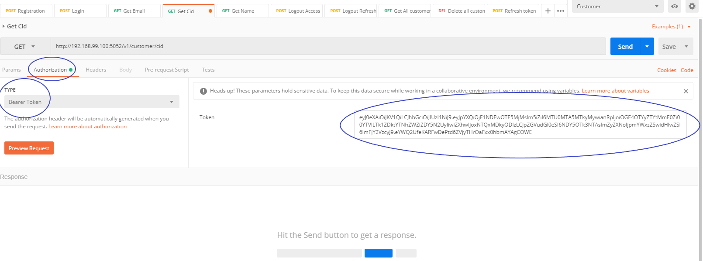

# How to use the Customer API

If you want to start using our API, here is how to get started.

## This document includes the following

The links scrolls you to that section.

1. [Storing information about the customer](#storing-information-tied-to-a-customer)
    * [Example](#example)
1. [Getting information about the Customer](#getting-information-about-the-customer)
    * [Get the customer identification number(cid)](#get-the-customer-identification-number-cid-of-the-currently-logged-in-customer)
    * [Get the email](#get-the-email-of-the-currently-logged-in-customer)
    * [Get the name](#get-the-name-of-the-currently-logged-in-customer)
1. [Full example](#full-example)
1. [Testing](#testing)
    * [Register](#register)
    * [Login](#login)
    * [Get information directly](#getting-information-directly-from-us)
    * [Get information through your system](#getting-information-via-your-system)
    * [What to do when access token expires/becomes invalid](#what-to-do-when-the-access-token-expiresbecomes-invalid)


__When referring to address, it is the following:__
* If you are using docker toolbox, the address is  http://192.168.99.100:5052/
* If you are using the new docker, the address is  http://127.0.0.1:5052/

> If you have any issues or something is unclear, please check out [FAQ](/faq.md) or contact Group 5 in the group classes or on slack(Bjørnar/Martin).

## Storing information tied to a Customer

If you intend to store information about the customer, for example if you are storing an order that a Customer has made and you want to have a reference to that customer in your database, you request the cid from us, and then store the cid in a column in your table (of orders for instance). We do have some rules that __MUST__ be followed: 

* Information that should be tied to a customer __MUST__ be stored along with the cid in __YOUR__ database(s). 
* Do __NOT__ store an email address, name, address or any other information that comes from us in your databases!
* Request other information(not included cid) __ONLY__ when it is used for something.
* If you need to reference a customer, you __MUST__ use the cid. 

The reason for this is that customer information can change, and the only thing that will definately not be changed is the cid, therefore all information __MUST__ be tied to that.

### Example 

```python
import requests
from flask import request

def get_headers():
    return {"Authorization": request.headers.get("Authorization")}

def get_cid():
    r = requests.get("<address>/v1/customer/cid", headers=get_headers())
    
    # If the status code is 500, an error on our part occured. Please contact us if you get these.
    if r.status() == 500:
        return r.json() # Contains "message" and "error" which tell you what happened

    #If the status code is 4xx, there is no logged in customer or the jwt sent is invalid
    elif r.status() >= 400 and r.status() < 500:
        return "Not logged in or Invalid authentication"

    cid = r.json()["cid"]

    return cid


def store_order():
    # The following is the way you should store it in the database
    order = NewOrder(
        "ID": <someNumber>, # This is your information
        "otherInformationThatYouHave": <someInformation, # This is your information
        "cid": get_cid() # This is the important part!
    )

```

## Getting information about the Customer

In order to get information about the customer, send a request with the authorization header(which contains the customer's jwt) that came from the client request.

> Why? Because when a customer logs in, a jwt-object is sent to and stored on the client(device of the customer). In order for us to give information about that Customer, we need the JWT-object to identify the Customer and confirm that they are logged in. Note: It is possible that in the future, there will be no need to send the header.

* The different Requests are covered below.

* To send the authorization header with the request, make a dict with the authorization header from the request you recieved.

* JWT Example in python with flask:
    ```python
    import requests
    from flask import request

    def get_headers():
        return {"Authorization": request.headers.get("Authorization")}

    def main():
        r = requests.get(<address>, headers= get_headers())
    ```

    > If there is no header, the jwt in the header is invalid, the response will be 4xx status code.

### The http status codes

> Note: Flask-JWT-Extended can send a variety of different 4xx responses, all of them indicates that something is wrong.

* 2xx:
    * 202 Created: Your request was accepted and you got a response with the information you requested.
    * 200 OK: Your request was processed as you requested

* 4xx status codes are at the moment controlled mostly by Flask-JWT-Extended, this will change in the near future. The following is what we have customized: 
    * 401 UNAUTHORIZED: The request was valid but the customer does not exist in the database.
    * More will come

### Get the Customer Identification Number (cid) of the currently logged in customer
__GET: /v1/customer/cid/__

To get the cid of a customer, send a get request to the docker url specified at the top with this URI: /v1/customer/cid
The number you get is 8 digits long(might change in the future).

> The returned cid is an integer. This cid number below(40129339) is just an example.

* On success, the status code is 202 and you get this json object: 
    ```json
       {
           "message": "Cid for the current customer was found",
           "cid": 40129339
       }
    ```

* On failure on the server, the status code is 500 and you get this json object:
    ```json
       {
           "message": "Something went wrong on the server", 
           "error": "<Error string>"
       }
    ```


* Example:

```python
import requests
from flask import request

def get_headers():
    return {"Authorization": request.headers.get("Authorization")}


def get_cid():
    # Getting the jwt with the customer identifier
    jti = get_raw_jwt()

    # Sending the get-request with header required
    r = requests.get("<address>/v1/customer/cid", headers=get_headers())
    
    # If the status code is 500, an error on our part occured
    if r.status() == 500:
        return r.json() # Contains "message" and "error" which tell you what happened

    #If the status code is 4xx, there is no logged in customer or the jwt sent is invalid
    elif r.status() >= 400 and r.status() < 500:
        return "Not logged in or Invalid authentication"
    
    # The message is recieved with every request and tell you what happened
    print(r.json()["message"])
    > "Cid for the current customer was found"
    
    # The cid from the response is gotten like this
    cid = r.json()["cid"]
    return cid

    # This is an example cid
    > 40129339

```

### Get the email of the currently logged in customer
__GET: /v1/customer/email__

To get the email of the currently logged in user, send a get request to the docker url specified at the top with this URI: /v1/customer/email

> The returned email is a string. The email below is just an example

#### Returns:
* On success, the status code is 202 and you get this json object: 
    ```json
       {
           "message": "Email for the current user was found",
           "email": "TestUser1@test.com"
       }
    ```
* On failure on the server, the status code is 500, and you get this json object:
    ```json
       {
           "message": "Something went wrong on the server", 
           "error": "<Error string>"
       }
    ```

* Example in python:
```python
import requests
from flask import request

def get_headers():
    return {"Authorization": request.headers.get("Authorization")}


def get_email():
    # Getting the jwt with the customer identifier
    jti = get_raw_jwt()["jti"]
    
    # Sending the get-request with the header required
    r = requests.get("127.0.0.1:5052/v1/customer/email", headers=get_headers()
    
    # If the status code is 500, an error on our part occured
    if r.status() == 500:
        return r.json() # Contains "message" and "error" which tell you what happened

    #If the status code is 4xx, there is no logged in customer or the jwt sent is invalid
    elif r.status() >= 400 and r.status() < 500:
        return "Not logged in or Invalid authentication"
    
    # The message is recieved with every request and tell you what happened
    print(r.json()["message"])
    > "Email of current Customer was found"
    
    # The email from the response is gotten like this
    email = r.json()["email"]
    return email

    # This is an example email
    > "TestCustomer1@test.com"

```

### Get the Name of the currently logged in customer
__GET: /v1/customer/name__

To get the name of the currently logged in customer, send a get request to the docker url specified at the top with this URI: /v1/customer/name.

> The returned firstName and lastName are strings. The name below is just an example. If the Customer does not have a first and/or last name, it will be an empty string

#### Returns

* On success, the status code is 202 and you get this json object:

    In this example the Customer's name is "Test Customer".
    ```json
       {
           "message": "The Name for the current customer was found",
           "fistName": "Test",
           "lastName": "Customer"
       }
    ```
* On failure on the server, the status code is 500, and you get this json object:

    ```json
       {
           "message": "Something went wrong on the server", 
           "error": "<Error string>"
       }
    ```

* Example in python:
```python
import requests
from flask import request

def get_headers():
    return {"Authorization": request.headers.get("Authorization")}


def get_name():
    jti = get_raw_jti()["jti"]
    
    # Sending the get-request with the header required
    r = requests.get("127.0.0.1:5052/v1/customer/name", headers=get_headers())
    
    # If the status code is 500, an error on our part occured
    if r.status() == 500:
        return r.json() # Contains "message" and "error" which tell you what happened

    #If the status code is 4xx, there is no logged in customer or the jwt sent is invalid
    elif r.status() >= 400 and r.status() < 500:
        return "Not logged in or Invalid authentication"
    
    # The message is recieved with every request and tell you what happened
    print(r.json()["message"])
    > "The Name of the current customer was found"

    # The name consist of firstName and Last name, we can organize them in a dict like this
    name["firstName"] = r.json()["firstName"]
    name["lastName"] = r.json()["lastName"]
    return name

    # This is what gets returned
    > {"firstName": <first name>, "lastName": <last name>}

```
## __The following section is for testing in the development phase only__
__The following endpoints will be removed before production__

### Get all customers in the database
__GET: /v1/customers__

To get everything from all customers, send a get request to the docker url specified at the top with this URI: /v1/customer/name.

> It returns every field of every customer in json

#### Returns

* On success, the status code is 200 and you get this json object:

    ```json
    {
        "customers": [
            {
                "email": "test@testing.com",
                "firstName": "Test",
                "lastName": "Customer",
                "password": "<hashed_password>"
            },
            {
                "email": "test1@testing.com",
                "firstName": null,
                "lastName": "Cust",
                "password": "<hashed_password>"
            }
        ]
    }
    ```
### Delete all customers in the database
__DELETE: /v1/customers__

To delete every customer in the database, send a DELETE request to the docker url specified at the top with this URI: /v1/customer/name.

> NOTE: This really do delete every customer in the database. This request will of course be removed before production.

#### Returns

* On success, the status code is 200 and you get this json object:
    ```json
    {
        "message": "X row(s) deleted"
    }
    ```
* On failure on the server, the status code is 500, and you get this json object:

    ```json
       {
           "message": "Something went wrong", 
           "error": "<Error string>"
       }
    ```

## Full example

Here is a full example of how to get information from our Api:

> The imagined setup here is that a customer(the client) sends a request to your backend, and you want information about that customer from the Customer database. 

```python
from flask import Flask, request
import requests

app = Flask(__name__)

def get_headers():
    return {"Authorization": request.headers.get("Authorization")}

@app.route("/cid")
def get_cid():
    # Sending the get-request with the header required
    r = requests.get("127.0.0.1:5052/v1/customer/cid", headers=get_headers())
    
    # If the status code is 500, an error on our part occured
    if r.status() == 500:
        return r.json() # Contains "message" and "error" which tell you what happened

    #If the status code is 4xx, there is no logged in customer or the jwt sent is invalid
    elif r.status() >= 400 and r.status() < 500:
        return "Not logged in or Invalid authentication"
    
    # The message is recieved with every request and tell you what happened
    print(r.json()["message"])
    # "Cid for the current customer was found"
    
    # The cid from the response is gotten like this
    cid = r.json()["cid"]
    return cid

@app.route("/email")
def get_email():
    # Sending the get-request with the header required
    r = requests.get("127.0.0.1:5052/v1/customer/email", headers=get_headers())
    
    # If the status code is 500, an error on our part occured
    if r.status() == 500:
        return r.json() # Contains "message" and "error" which tell you what happened

    #If the status code is 4xx, there is no logged in customer or the jwt sent is invalid
    elif r.status() >= 400 and r.status() < 500:
        return "Not logged in or Invalid authentication"

    # The message is recieved with every request and tell you what happened
    print(r.json()["message"])
    # "Email of current Customer was found"
    
    # The email from the response is gotten like this
    email = r.json()["email"]
    return email

@app.route("/name")
def get_name():
    # Sending the get-request with the header required
    r = requests.get("127.0.0.1:5052/v1/customer/name", headers=get_headers())
    
    # If the status code is 500, an error on our part occured
    if r.status() == 500:
        return r.json() # Contains "message" and "error" which tell you what happened

    #If the status code is 4xx, there is no logged in customer or the jwt sent is invalid
    elif r.status() >= 400 and r.status() < 500:
        return "Not logged in or Invalid authentication"
    
    # The message is recieved with every request and tell you what happened
    print(r.json()["message"])
    # "The Name of the current customer was found"

    # The name consist of firstName and Last name, we can organize them in a dict like this
    name["firstName"] = r.json()["firstName"]
    name["lastName"] = r.json()["lastName"]
    return name

if __name__ == "__main__":
    app.run(port=5002)
```

## Testing

If you have any problems with this, please contact us.

### Getting started

1. If you want to test your code which is using our API, we recommend using [Postman](https://www.getpostman.com/).

1. You can get a collection of all our routes by clicking import in Postman and paste this url: https://www.getpostman.com/collections/d7ec5888840ed1cfe010

1. You are ready to start.

If you couldnt import the collection, the routes are as follows:
* Registration: POST /v1/registration
* Login: POST /v1/login
* Logout Access: POST /v1/logout/access
* Logout Refresh: POST /v1/logout/refresh
* Refresh token: POST /v1/token/refresh
* Get Cid: GET /v1/customer/cid
* Get Email: GET /v1/customer/email
* Get Name: GET /v1/customer/name
* Get All customers: GET /v1/customers
* Delete all customers: DELETE /v1/customers

> Note: Using an environment in Postman can be very beneficial. Then you can add variables, and then mark the access token, right click, set, and then choose a variable. You can then instead of pasting it in every request, you can just write it like this: {{variable_name}} in the _Bearer token_ field.

### Start testing
> __Bold__ is a variable or a name of something. _Cursive_ is a field or a button in Postman.

#### Register
1. To register a customer use the Registration route, click "body", click form-data, add email and password and click send. 
    

1. After a second or 2, you should get a response, hopefully with a message, access token and refresh token. Like this: 
    

1. The access token is what you will use when getting information, so copy that.

#### Login
Login works exactly like register for testing

1. Select the login route

1. Put email and password in the form-data field.

1. Send

1. Recieve tokens

#### Getting information directly from us

The following also works exactly the same way for __email__ and __name__, I will use __cid__ as an example.

1. Select the _Get Cid_ request from the collection.

1. Click _Authorization_, then select __Bearer token__ as _TYPE_, and paste the __access token__ in the left field.
    

1. Click _Send_.

1. Then after a second or 2, you hopefully get a message and the __cid__, like this: 
    

#### Getting information via your system
At this point you should have implemented the code as shown in the [Getting information about the customer](#getting-information-about-the-customer) section.

Then all you have to do is:

1. Make a new request with the plus icon almost top left

1. Write your __address__ in the _address_ field.

1. Paste the __access token__ in the _Authorization field_ as described above.

1. Click _send_.

#### What to do when the access token expires/becomes invalid?
You have 2 options, either login again with the __email__ and __password__ as described above, or refresh the token as follows:

1. Copy the __refresh token__ you got after registering or login.

1. Select the _Refresh token_ request from the collection.

1. Paste it in the _Authorization Bearer token_ field.

1. Click _send_.

1. Recieve a new __access token__. Use that instead of the old __access token__.

#### Logout
1. Select the _Logout access_ or _Logout refresh_ request from the collection.

1. Put the __access token__ or refresh token(based on what logout request you chose) as a _Bearer token_ in _Authorization_.

1. Click _send_.

#### Get/Delete all customers
This request is only available in the development phase.

1. Select _Get all customers_ or _Delete all customers_ request from the collection
    > Note: The _Delete all customers_ request will delete all the customers from the database! 

1. Click _send_